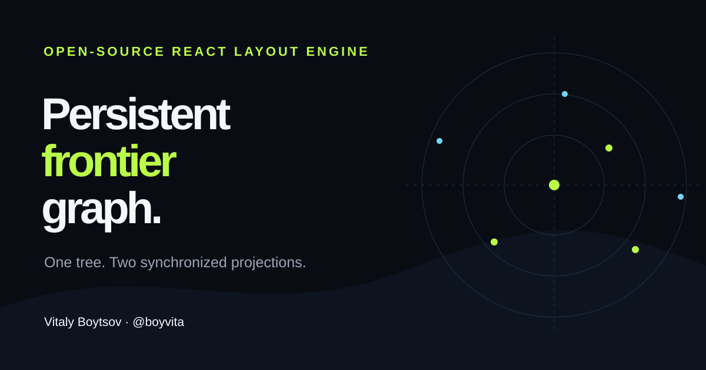

# Persistent Frontier Graph

[](https://boyvita.github.io/persistent-frontier-graph/)
[](https://github.com/boyvita/persistent-frontier-graph/actions/workflows/ci.yml)
[](LICENSE)
[](https://react.dev/)



Persistent Frontier Graph is an extensible React and TypeScript library for
exploring large rooted trees as a left-to-right cone and a radial tree. It is a
compact, convenient way to keep both readable views synchronized. The cone
camera derives a fractional coordinate frontier automatically, so navigation
expands or collapses both projections without a separate depth control.

[Open the interactive playground](https://boyvita.github.io/persistent-frontier-graph/) ·
[Read the specification](docs/specification.md) ·
[See customization recipes](docs/customization.md)

## Why this layout exists

Traditional tree views tend to trade one problem for another. A radial tree
preserves family shape but becomes hard to read at depth; a conventional mind
map is readable but often repacks and jumps as levels appear. This library keeps
the useful invariants of both:

- hierarchy depth always maps to a stable column and ring;
- sibling subtrees never interleave;
- every parent stays centered between its extreme boundary children;
- camera-derived frontier changes interpolate complete layouts, rather than
  moving nodes independently;
- topology stays mounted while coordinates collapse, preserving stable node identity;
- the cone and radial views derive from the same immutable snapshot;
- the radial viewfinder contains exactly the nodes inside the current cone camera;
- generated random trees remain reproducible through an explicit seed.

The implementation was extracted and generalized from Vitaly Boytsov's graph
work at source revision `8b036cdf0bd811dff5d12fa078d5ebae21239133`.
Application-specific block editing, colors, review state, and provider logic are
intentionally absent.

## Try it

This project is not published to npm. Install it directly from GitHub and pin a
tag or commit in production:

```bash
npm install github:boyvita/persistent-frontier-graph#v0.1.0
```

The Git install runs the library build and provides ESM plus TypeScript
declarations. React and React DOM are peer dependencies.

```tsx
import {
  PersistentFrontierGraph,
  generateTree,
} from "persistent-frontier-graph";
import "persistent-frontier-graph/styles.css";

const generated = generateTree({
  nodeCount: 250,
  maxBranches: 6,
  maxDepth: 9,
  breadthDepthBias: 0.35, // 0 = breadth, 1 = depth
  uniform: true,
  seed: "design-review",
});

export function Example() {
  if (!generated.ok) return <p>{generated.error.message}</p>;
  return <PersistentFrontierGraph tree={generated.tree} />;
}
```

## Generator controls

| Option | Contract |
|---|---|
| `nodeCount` | Exact integer from 1 to 1,000 |
| `maxBranches` | Maximum children per node |
| `maxDepth` | Maximum edge distance from the root |
| `breadthDepthBias` | `0` favors shallow/wide insertion; `1` favors deep/long insertion |
| `uniform` | Balances sibling subtree sizes when true; uses seeded weighted random selection when false |
| `seed` | Makes the same options produce the same IDs and parent structure |

An impossible request returns a typed `capacity_exceeded` result. It never
silently changes `nodeCount`, depth, or branching limits. The playground's
**Regenerate** button creates a new seed and replaces the tree only after a
valid result is complete.

## Extensibility

Geometry is opinionated; presentation is not. The public API provides:

- `renderNode` for view-aware node contents;
- `renderEdge` for domain-specific edge appearance;
- read-only `overlays` for annotations, guides, metrics, and minimaps;
- revision-bound `actions` and `onAction` for extra functions;
- controlled selection and `getNodeLabel` for application data;
- `createFrontierGraphModel`, `layoutCone`, and `layoutRadial` for headless use;
- viewport-window and radial-sector derivation for custom cameras.

Extensions receive immutable snapshots and narrow callbacks. They do not gain a
hidden mutable store. See [Customization](docs/customization.md) and the
[examples](examples/README.md).

## Public modules

| Area | Main exports |
|---|---|
| Tree | `FrontierTree`, `FrontierNode`, `validateTree`, `indexTree` |
| Generation | `generateTree`, `treeCapacity`, `GenerateTreeOptions` |
| Frontier | `deriveFrontierSnapshot`, `createFrontierGraphModel` |
| Layout | `layoutCone`, `layoutRadial`, layout option/result types |
| Viewport | `deriveProjectionViewportWindow`, `deriveRadialProjectionSector` |
| React | `PersistentFrontierGraph`, `useFrontierGraph` |
| Extensions | node/edge/overlay/action contracts and controlled selection |

The complete contract lives in the [API reference](docs/api.md).

## Accessibility and performance

The visual canvases support direct card or background drag, cursor-anchored
wheel navigation, responsive fit, and zoom buttons. Wheel gestures are captured
inside a canvas instead of scrolling the document. Retargetable frame-bounded
motion keeps the painted cards and gesture state in one coordinate frame. The
bundled component keeps the cone and radial canvases at an equal 50/50 width
across zoom and responsive viewport changes. The composite derives the cone
camera's exact card-intersection set before rendering either view; the radial annular sector
shows only that set while the camera-derived frontier controls coordinate
collapse and pull motion. Every topology node remains mounted. A synchronized native node
navigator provides a keyboard and assistive-technology equivalent even when
hundreds of graph points are packed into a small viewport. Focus indicators,
reduced-motion behavior, labels, and WCAG 2.2 automated checks are part of CI.

The core uses immutable inputs, iterative traversal, and linear-size output.
Tests cover a 1,000-node tree. Rendering cost still depends on the consumer's
node renderer and visible camera window; benchmark your own presentation.

## Development

Requires Node.js 24.

```bash
npm ci
npx playwright install chromium
npm run check:all
npm run dev
```

`npm run check` runs lint, strict TypeScript, unit/component tests, both builds,
a built-package runtime/type consumer smoke test, and a package-content dry
run. `npm run test:browser` runs desktop and mobile Chromium interaction and
accessibility journeys.

## Documentation

- [Documentation map](docs/README.md)
- [Normative specification](docs/specification.md)
- [Algorithm explanation](docs/algorithm.md)
- [API reference](docs/api.md)
- [Customization and reuse](docs/customization.md)
- [Examples](examples/README.md)
- [Contributing](CONTRIBUTING.md)
- [Security policy](SECURITY.md)

## Status

The project is pre-1.0. Pin a commit when consuming it from GitHub. Public API
changes are documented in [CHANGELOG.md](CHANGELOG.md); npm publication is
deliberately disabled.

Designed and maintained by [Vitaly Boytsov](https://github.com/boyvita).
Released under the [MIT License](LICENSE).
