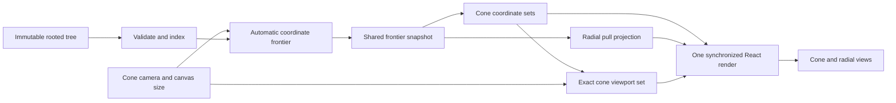

# How the algorithm works

The library treats layout as a sequence of complete, deterministic coordinate
sets. This is the central difference from independently animating nodes toward
new targets.

## Pipeline



The tree owns structure. The cone camera determines the coordinate frontier;
it never removes topology. Layouts own derived coordinates. The composite
React boundary owns the camera snapshots and canvas sizes. It derives the
frontier, cone window, and radial membership before rendering either view, so a
child effect cannot introduce a stale radial frame.

## 1. Index once

`indexTree` builds maps for nodes, children, parents, and depths through an
iterative breadth-first traversal. Siblings use stable ID ordering, so equal
inputs never depend on object enumeration or browser timing.

## 2. Derive the frontier and find its integer boundary

The camera's radial offset plus its visible world span determines how many
depth bands fit in the cone. Expansion is adaptive: the first half of a new
band holds the previous coordinate set; the second half maps linearly to the
next set. This prevents a barely exposed column from immediately repacking the
whole tree.

For a level `k`, depth-first traversal stops at either:

- the first node at depth `k`; or
- a terminal node above `k`.

The result is a left-to-right boundary with exactly one representative for
every branch. It preserves the leaf ordering of the whole tree.

Adjacent representatives are separated by a base card gap. When their lowest
common ancestor is farther away, the algorithm adds a bounded hierarchy gap.
This makes family boundaries readable without allowing sparse trees to explode
in height.

## 3. Center parents bottom-up

After boundary centers are known, each ancestor receives:

```text
parentY = (minimumDirectChildY + maximumDirectChildY) / 2
```

The calculation proceeds from deepest nodes to the root. A subtree therefore
remains one contiguous interval, and its parent never drifts toward whichever
child happened to be inserted last.

Nodes below the current boundary retain their real X depth but inherit their
boundary ancestor's Y. They are spatially collapsed without corrupting
hierarchy depth.

When a parent center would fall outside the vertical camera interval, its
display center is clamped to the nearest viewport edge within the legal span
between its canonical center and extreme child. This keeps context visible
without changing X depth.

## 4. Interpolate whole layouts

For fractional frontier `F`, the library calculates the lower and upper integer
sets and blends every node:

```text
position(F) = position(floor(F)) × (1 - α)
            + position(ceil(F))  × α

α = F - floor(F)
```

Because both endpoints are valid complete layouts, all intermediate positions
keep subtree order. Lines remain attached to the exact node centers.

## 5. Build canonical radial geometry

Terminal nodes receive ordered angles between the fixed seam paddings near
`-π` and `π`. Each parent uses the midpoint of its extreme child angles.
Hierarchy depth chooses the ring, while density can only push a ring farther
out—it can never create a false depth.

```text
radius[d] = max(
  radius[d - 1] + minimumRingGap,
  nodesAtDepth[d] × nodePitch / 2π
)
```

## 6. Pull the radial tree through the same frontier

At frontier `k`, a deeper point is placed on its ancestor at depth `k`. Between
`k` and `k + 1`, only the next ring moves from ancestor coordinates toward its
canonical points. The visual result is a set of branches being pulled out of
their parent rather than appearing from unrelated locations.

The cone and radial layouts share one coordinate snapshot. Every node remains
mounted; there is no second radial collapse state to become stale.

## 7. Project the cone camera back onto the circle

After cone layout, the camera transform and canvas size define a world-space
rectangle. A card belongs to the projection window when its layout rectangle
intersects that world rectangle. This produces an exact discrete ID set after
every pan, zoom, resize, or automatically derived frontier change.

The radial view converts the minimum and maximum member depths to annular ring
boundaries and the ordered member angles to a sector envelope. Geometry makes
the viewfinder legible; the discrete set remains authoritative. Radial nodes
and edges outside that set are hidden, so the points shown by the radial
viewfinder are exactly the cards currently present in the cone viewport.

## Complexity

Indexing and each coordinate pass use linear-size storage. Boundary gap lookup
walks parent chains, so worst-case layout time is `O(N × D)` for `N` nodes and
depth `D`; configured depth is capped at 64. Only lower, upper, and canonical
sets are produced for a request—there is no cache of every possible level.

The React layer keeps the topology mounted so frontier motion preserves node
identity. The radial viewfinder alone hides points outside the exact cone
window. At 1,000 nodes, consumer renderer complexity and label density become
the dominant costs.

The committed camera state is also the painted state. Position changes do not
run through a second CSS transform tween, because that would make hit testing
and cursor anchoring observe different coordinate frames.

## Interaction motion

Wheel, drag, and button targets feed one request-animation-frame loop. Two
low-pass stages preserve velocity while repeated events replace the live target
without restarting from an older endpoint. Before publishing a candidate, the
loop projects every currently or newly visible card corner into screen space.
If any corner would exceed the per-frame pixel budget, it backs off the camera
interpolation ratio and verifies the resulting geometry again.

Pointer release cancels the remaining target and retains the last committed
camera. A new gesture therefore starts from what the user actually sees. At
the complete overview boundary, cursor anchoring yields to the centered Fit
camera so no stale vertical offset survives a saturated zoom-out gesture.
